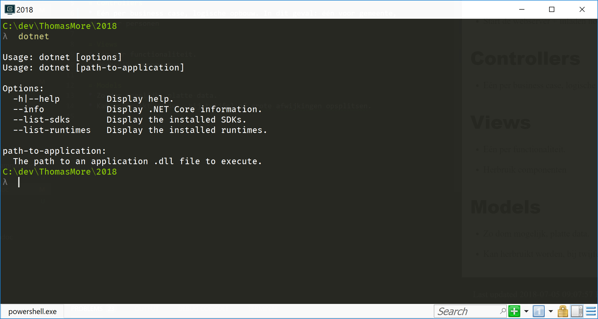
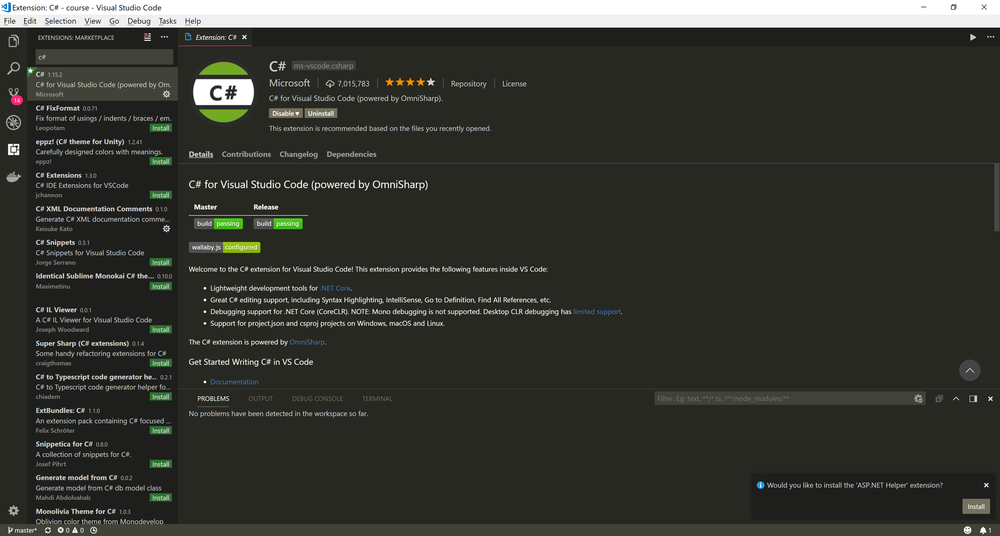

# .NET Core

##Waarom
* Cross-platform.
* Kan bijgevolg ook in containers (docker e.a.) gedeployed worden.

## Links
* [.NET Core](https://www.microsoft.com/net/download/)

## Hoe te installeren
* Installatiebestand downloaden van de website en installeren.
* Testen door in een console/command prompt `dotnet` uit te voeren.

# Visual Studio Code

## Waarom
* Gratis.
* Cross-platform.
* Lightweight (tegenover Visual Studio).
* Kan uitgebreid worden met extensions.
* Constante (maandelijkse) updates.

## Links
* [Visual Studio Code](https://code.visualstudio.com/)
* [C# extension](https://marketplace.visualstudio.com/items?itemName=ms-vscode.csharp)
* [ASP.NET Helper](https://marketplace.visualstudio.com/items?itemName=schneiderpat.aspnet-helper) - Zorgt voor intellisense voor razor files.

## Hoe te installeren. 
- Installeer eerst Visual Studio Code zelf.
- Installeer daarna de extensions. Dit kan ofwel via de website ofwel via de extension manager van Visual Studio Code zelf.

