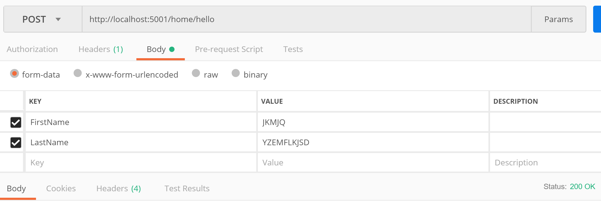
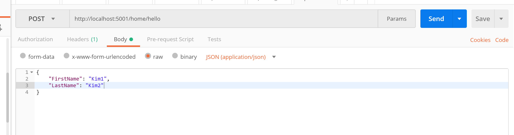

# Controllers

* Zijn verantwoordelijk voor de flow van de applicatie te beheren.
* Nemen dus een request binnen en sturen een response terug buiten

## Routing

Het is niet verplicht om dit via controllers af te handelen, maar het is wel de makkelijkste manier.


### Attributes

Vergelijk de volgende twee controller methodes:

```csharp
[Controller]
  [Route("home")]
  public class HomeController : Controller
  {
    // home/hello
    [HttpGet("hello")]
    public IActionResult Hello()
    {
      return View(new BaseModel() { 
        FirstName = "Raf", 
        LastName = "Ceuls" 
      });
    }

    // home/hello2
    [HttpGet("hello2")]
    public IActionResult HelloAgain()
    {
      return View("Hello", 
        new BaseModel() {
          FirstName = "Jos",
          LastName = "Vermeulen" 
        });
    }
  }
```

> `HelloAgain` dient manueel de view aan te duiden anders probeert de controller het item `hello2.cshtml` te resolven in `views\home` .

### Route Parameters

```csharp
// home/hello?raf/ceuls
[HttpGet("hello/{firstname}/{lastname}")]
public IActionResult Hello([FromRoute]string firstname,   [FromRoute]string lastname)
{
  return View(new BaseModel()
  {
    FirstName = person.FirstName,
    LastName = person.LastName
  });
}
```

### Query Parameters

```csharp
// /home/hello?firstname=raf
// /home/hello?firstname=jos&lastname=vermeulen
// /home/hello
[HttpGet("hello")]
public IActionResult Hello([FromQuery]string firstname, [FromQuery]string lastname)
{
  return View(new BaseModel()
  {
    FirstName = person.FirstName ?? "Raf",
    LastName = person.LastName ?? "Ceuls"
  });
}
```

### Complexe objecten

```csharp
public class Person
{
  public string FirstName { get; set; }
  public string LastName { get; set; }
}

// /home/hello?firstname=raf
// /home/hello?firstname=jos&lastname=vermeulen
// /home/hello
[HttpGet("hello")]
public IActionResult Hello([FromQuery]Person person)
{
  return View(new BaseModel()
  {
    FirstName = person.FirstName ?? "Raf",
    LastName = person.LastName ?? "Ceuls"
  });
}
```

### POST - Form parameters

```csharp
[HttpPost("hello")]
public IActionResult SaveHello([FromForm]Person person)
{
  return View("Hello", new BaseModel()
  {
    FirstName = person.FirstName ?? "Raf",
    LastName = person.LastName ?? "Ceuls"
  });
}
```

Dit kan je aanroepen door met postman de volgende call te doen:



### POST - Body

```csharp
[HttpPost("hello")]
public IActionResult SaveHello([FromBody]Person person)
{
  return View("Hello", new BaseModel()
  {
    FirstName = person.FirstName ?? "Raf",
    LastName = person.LastName ?? "Ceuls"
  });
}
```

Dit kan je aanroepen door met postman de volgende call te doen:



